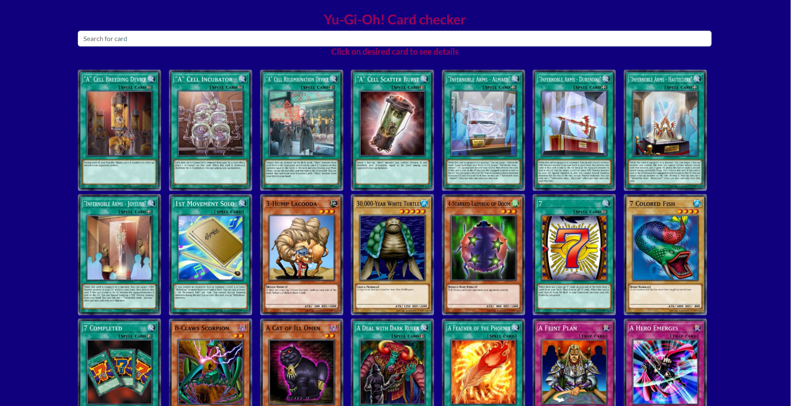

# Proyecto Final: Yu-Gi-Oh! Card Checker

This project was generated using [Angular CLI](https://github.com/angular/angular-cli) version 17.0.5. It serves as a solution for the final project of the professional Angular course at Código Facilito. The goal of the project is to showcase fundamental aspects of Angular learned during the course, including routing, services, the use of pipes and directives, and other skills. This is achieved by consuming the [YGOPRODeck API](https://ygoprodeck.com/api-guide/).

## Table of Contents

- [Overview](#overview)
   - [The Challenge](#the-challenge)
   - [Screenshots and GIFs](#screenshots-and-gifs)
   - [Links](#links)
- [My Process](#my-process)
   - [Built With](#built-with)
   - [What I Learned](#what-i-learned)
   - [Continued Development](#continued-development)
   - [Useful Resources](#useful-resources)
- [Author](#author)
- [Acknowledgments](#acknowledgments)

## Overview

### The Challenge

The challenge was to build an Angular web application called Yu-Gi-Oh! Card Checker. The task involved utilizing Angular knowledge to make requests to the Yu-Gi-Oh! API by YGOPRODeck, creating a website that allows users to see an infinite scroll of Yu-Gi-Oh! cards, search for particular cards, and view their details and pricing options in the online market.

#### Features

- The website incorporates an infinite scroll.
- Users can navigate through the website's content by scrolling.
- Users can search for existing cards in the API database.
- Users can view the details of each card by simply clicking on it.

#### Prerequisites

- HTML
- CSS
- JavaScript
- Angular
- Git and GitHub
- HTTP Requests and Responses

### Screenshots and Videos

This is the live site of the web app: [click here](https://proyectofinal-yugioh-card-checker.vercel.app/).

### Links

- Solution URL: [GitHub Repository](https://github.com/light-roast/proyectofinal-angular-yugioh)

## My Process

### Built With

- Semantic HTML5 markup
- Custom CSS properties. SCSS.
- Flexbox
- Responsive design principles
- Angular
- ngx-infinite-scroll.

### What I Learned

I acquired a solid foundation for creating functional and scalable web apps with Angular through this course and the hands-on experience gained from this project.

### Continued Development

I am eager to delve into the basics of testing for this type of Angular app. Specifically, I am guided by the question: What aspects of this specific app should I focus on testing?

### Useful Resources

- [YGOPRODeck API Documentation](https://ygoprodeck.com/api-guide/)

## Author

- Website: [Daniel Echeverri Llano](https://light-roast.github.io/portafolio/)
- Frontend Mentor: [@light-roast](https://www.frontendmentor.io/profile/light-roast)
- Twitter: [@echeverri_llano](https://www.twitter.com/echeverri_llano)

## Development server

Run `ng serve` for a dev server. Navigate to `http://localhost:4200/`. The application will automatically reload if you change any of the source files.

## Code scaffolding

Run `ng generate component component-name` to generate a new component. You can also use `ng generate directive|pipe|service|class|guard|interface|enum|module`.

## Build

Run `ng build` to build the project. The build artifacts will be stored in the `dist/` directory.

## Running unit tests

Run `ng test` to execute the unit tests via [Karma](https://karma-runner.github.io).

## Running end-to-end tests

Run `ng e2e` to execute the end-to-end tests via a platform of your choice. To use this command, you need to first add a package that implements end-to-end testing capabilities.

## Further help

To get more help on the Angular CLI use `ng help` or go check out the [Angular CLI Overview and Command Reference](https://angular.io/cli) page.
